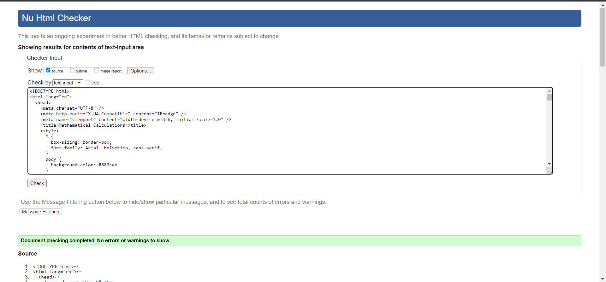
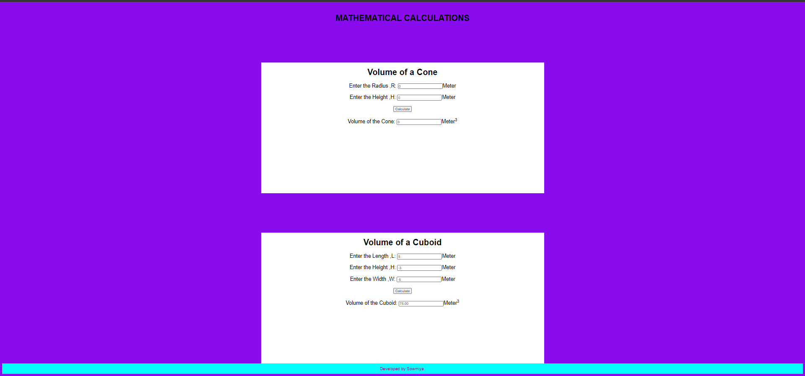
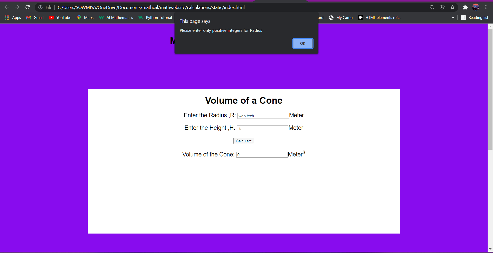
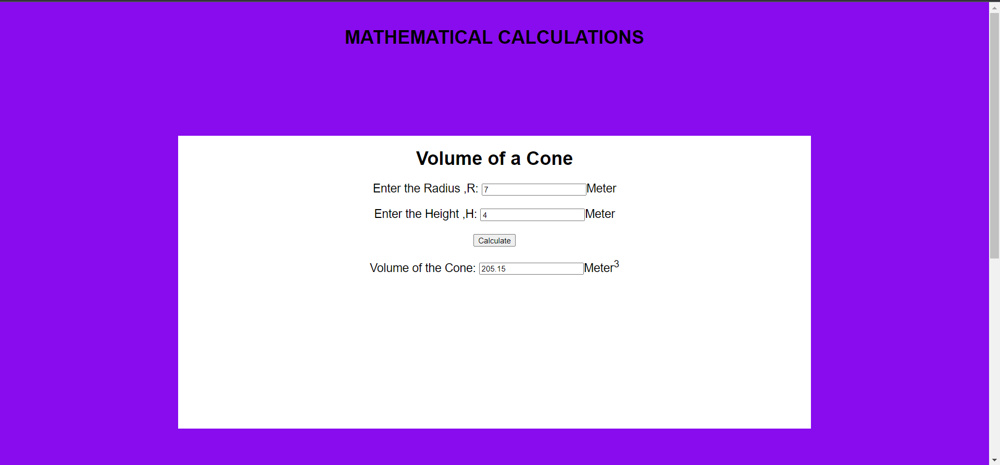
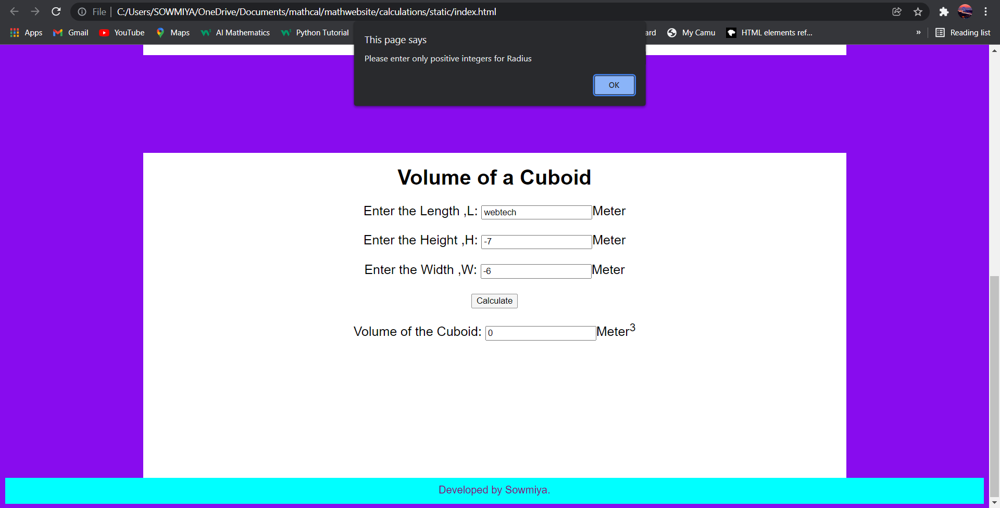
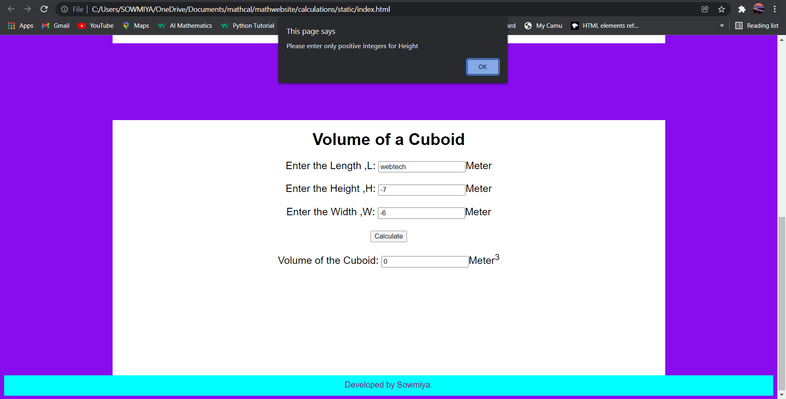
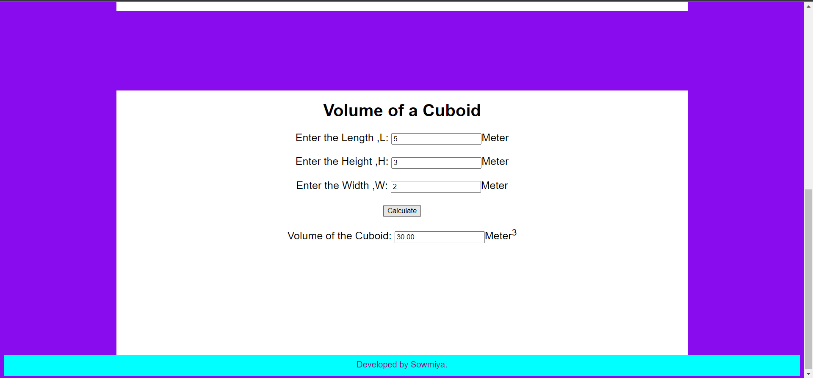

# Web Page for Mathematical Calculations

## AIM:

To design a static website with validation to perform mathematical calculations in client side.

## DESIGN STEPS:

### Step 1:

Requirement collection.

### Step 2:

Creating the layout using HTML and CSS.

### Step 3:

Write javascript to perform the calculations.

### Step 4:

Include regularexpression based input validation.

### Step 5:

Validate the layout in various browsers.

### Step 6:

Validate the HTML code.

### Step 6:

Publish the website in the given URL.

## PROGRAM :

```

<!DOCTYPE html>
<html lang="en">
  <head>
    <meta charset="UTF-8" />
    <meta http-equiv="X-UA-Compatible" content="IE=edge" />
    <meta name="viewport" content="width=device-width, initial-scale=1.0" />
    <title>Mathematical Calculations</title>
    <style>
      * {
        box-sizing: border-box;
        font-family: Arial, Helvetica, sans-serif;
      }
      body {
        background-color: #880cee
      }
      .container {
        width: 1080px;
        margin-left: auto;
        margin-right: auto;
      }
      .content {
        display: block;
        width: 100%;
        background-color: white;
        min-height: 500px;
        margin-top:150px
      }
      h1{
          text-align: center;
          padding-top: 20px ;
      }
      .formelement{
          text-align: center;
          margin-top: 20px;
          margin-bottom: 20px;
          font-size: 20px;
      }
      .footer {
  display: block;
  width: 100%;
  height: 40px;
  background-color:  cyan;
  text-align: center;
  padding-top: 10px;
  margin: 0px 0px 0px 0px;
  color:purple;
}
          </style>
      
  </head>
  <body>
    <h1>MATHEMATICAL CALCULATIONS</h1>
    <div class="container">
      <div class="content">
          <h1 >Volume of a Cone</h1>
          <form>
              <div class="formelement">
                  <label for ="redit">Enter the Radius ,R: </label>
                  <input type="text" id="redit" value="0"/>Meter
              </div>
              <div class="formelement">
                  <label for="hedit">Enter the Height ,H:</label>
                  <input type="text" id="hedit" value="0"/>Meter
              </div>
              <div class="formelement">
                  <input type="button" value="Calculate" id="calbutton"/>
              </div>
              <div class="formelement">
                  <label for="coneedit">Volume of the Cone:</label>
                  <input type="text" id="coneedit" value="0" readonly />Meter<sup>3</sup>
              </div>
          </form>
      </div>
  </div>
  <script type="text/javascript">
  var button;
  button=document.querySelector("#calbutton");
  button.addEventListener("click",function(){
      var rtext,htext,conetext;
      var rval,hval,coneval;
      var r1,r2,rexp;
      rtext=document.querySelector("#redit");
      htext=document.querySelector("#hedit");
      conetext=document.querySelector("#coneedit");

      rexp=new RegExp("^[1-9]+[0-9]*$");

      rval=rtext.value;
      r1=rval.match(rexp);
      hval=htext.value;
      r2=rval.match(rexp)

      if(r1==null)
        {
            alert("Please enter only positive integers for Radius");
        }
        if(r2==null)
        {
            alert("Please enter only positive integers for Height")
        }

      coneval=3.14*rval*rval*(hval/3);
     
      conetext.value=""+coneval.toFixed(2);
      

  });
  </script>
  
  
  <div class="container">
      <div class="content">
          <h1 >Volume of a Cuboid</h1>
          <form>
              <div class="formelement">
                  <label for ="rad">Enter the Length ,L:</label>
                  <input type="text" id="rad" value="0"/>Meter
              </div>
              <div class="formelement">
                  <label for="heig">Enter the Height ,H:</label>
                  <input type="text" id="heig" value="0"/>Meter
              </div>
              <div class="formelement">
                <label for="widh">Enter the Width ,W:</label>
                <input type="text" id="widh" value="0"/>Meter
            </div>
              <div class="formelement">
                  <input type="button" value="Calculate" id="volbutton"/>
              </div>
              <div class="formelement">
                  <label for="cube">Volume of the Cuboid:</label>
                  <input type="text" id="cube" value="0" readonly />Meter<sup>3</sup>
              </div>
          </form>
      </div>
  </div>
  <script type="text/javascript">
  var volbutton;
  volbutton=document.querySelector("#volbutton");
  volbutton.addEventListener("click",function(){
      var ratext,hetext,witext,cubetext;
      var raval,heval,wival,cubeval;
      var regexp,res1,res2,res3;
      ratext=document.querySelector("#rad");
      hetext=document.querySelector("#heig");
      witext=document.querySelector("#widh");
      cubetext=document.querySelector("#cube");

      regexp=new RegExp("^[1-9]+[0-9]*$");

      raval=ratext.value;
      res1=raval.match(regexp);
      heval=hetext.value;
      res2=heval.match(regexp);
      wival=witext.value;
      res3=wival.match(regexp);
      
      if(res1==null)
        {
            alert("Please enter only positive integers for Radius");
        }
        if(res2==null)
        {
            alert("Please enter only positive integers for Height")
        }
        if(res3==null)
        {
            alert("Please enter only positive integers for Width")
        }

      cubeval=raval*wival*heval
      cubetext.value=""+cubeval.toFixed(2);
  });
  </script>
  <div class="footer">
     Developed by Sowmiya.
  </div>
  </body>
  </html>
```

## OUTPUT:

## HTML VALIDATOR :



## WEBSITE OUTPUT :


## OUTPUT - WITH ERROR MESSEGE(calculation 1)



## OUTPUT - WITHOUT ANY ERROR(calculation 1)


## OUTPUT - WITH ERROR MESSEGE(calculation 2)




## OUTPUT - WITHOUT ANY ERROR(calculation 2)



## Result:

Thus a website is designed to perform mathematical calculations in the client side.
